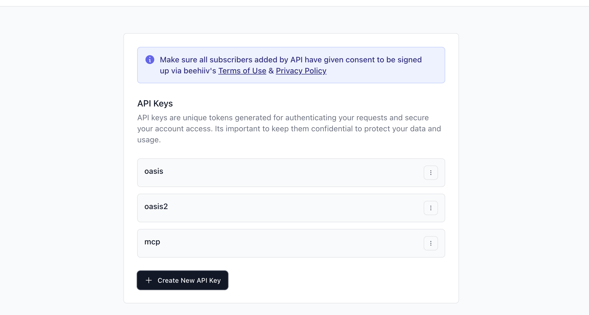
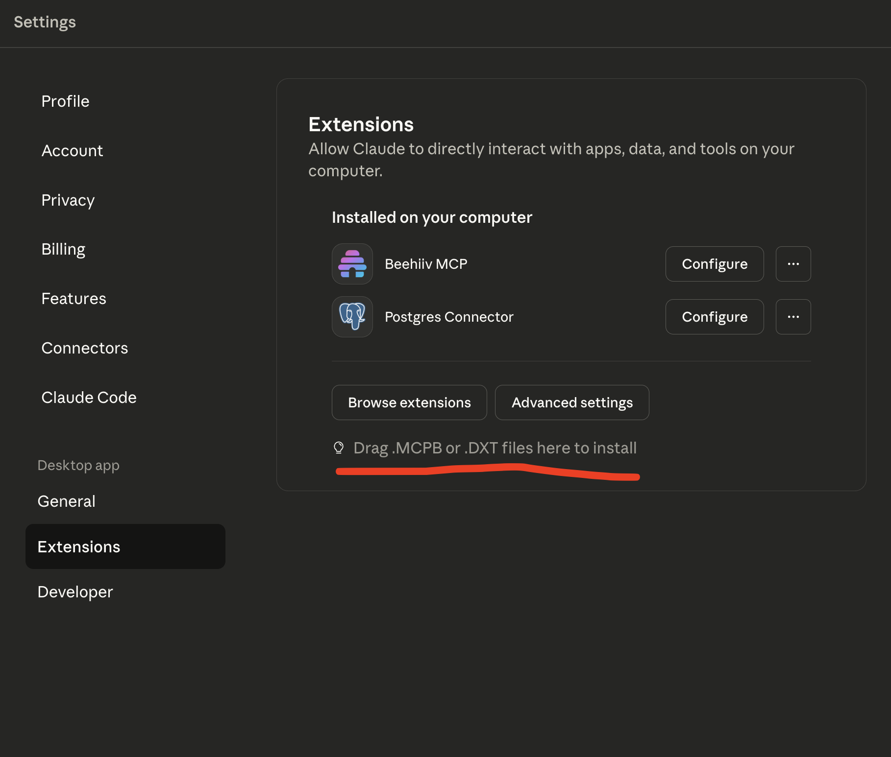
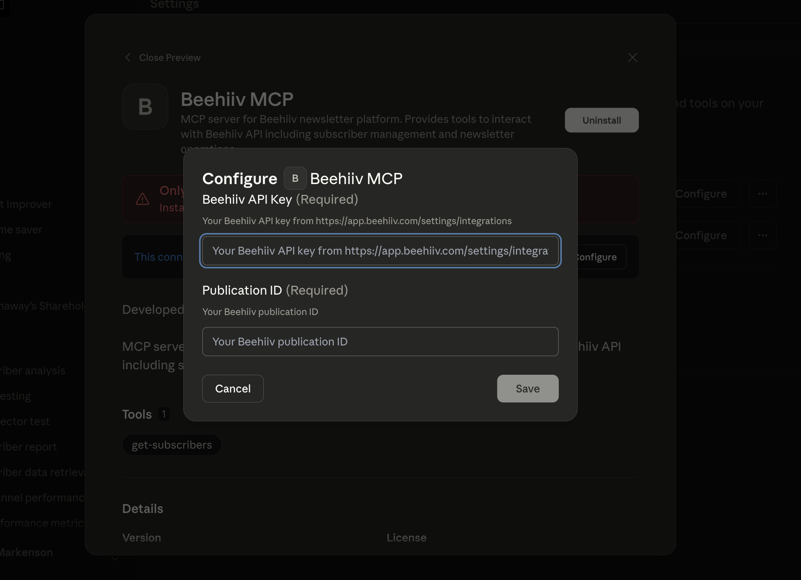

# Beehiiv MCP


A Model Context Protocol (MCP) server for integrating with the Beehiiv newsletter platform. This MCP provides tools to interact with the Beehiiv API, allowing you to retrieve subscriber information and manage your newsletter operations programmatically.

## 🚀 Features

- **Get Subscribers**: Retrieve subscriber data with advanced filtering and pagination
- **TypeScript Support**: Full TypeScript implementation with proper error handling
- **Environment Configuration**: Secure API key and publication ID management
- **Comprehensive Filtering**: Support for status, tier, email, and custom field filtering
- **Pagination Support**: Cursor-based pagination for efficient data retrieval

## 🛠️ Quick Start

### Prerequisites

- Node.js 18.0.0 or higher
- A Beehiiv account with API access
- Your Beehiiv API key and Publication ID

### Installation

#### Install in Claude Desktop (Claude Code)

1. Prepare your Beehiiv credentials
   - You will need your Beehiiv API key and your Publication ID.
   - In Beehiiv, go to Settings → Integrations to create or view your API key.
   
   

2. Upload the MCP bundle to Claude Desktop
   - Open the Claude Desktop app.
   - Navigate to Settings → Extensions.
   - Drag-and-drop the bundle file [beehiiv-mcp.mcpb](beehiiv-mcp.mcpb), or go to Advanced settings → Install extension and select the same file from the project root.

   

3. Configure environment variables for the extension
   - In the extension configuration screen, add the required variables:
     - `BEEHIIV_API_KEY`: your Beehiiv API key
     - `BEEHIIV_PUBLICATION_ID`: your Beehiiv publication ID
   - Save the configuration.

   

4. Use it in Claude Code
   - Open a Claude chat (Claude Code) and ask something like: "Use the Beehiiv MCP to fetch subscribers".
   - You can also verify tools are available via the Extensions view.

Note: The MCP bundle file is included at the repository root as `beehiiv-mcp.mcpb`. If you build from source, you can continue to use the JSON-based configuration below as an alternative to the bundle.


### Testing Your MCP Server

#### Using MCP Inspector

```bash
BEEHIIV_API_KEY=your_api_key BEEHIIV_PUBLICATION_ID=your_pub_id npx @modelcontextprotocol/inspector ./src/server.ts
```

#### Integrating with Claude Desktop

Add this configuration to your Claude Desktop config file:

**macOS**: `~/Library/Application Support/Claude/claude_desktop_config.json`
**Windows**: `%APPDATA%/Claude/claude_desktop_config.json`

```json
{
  "mcpServers": {
    "beehiiv": {
      "command": "node",
      "args": ["/path/to/beehiiv-mcp/src/server.ts"],
      "env": {
        "BEEHIIV_API_KEY": "your_beehiiv_api_key_here",
        "BEEHIIV_PUBLICATION_ID": "your_publication_id_here"
      }
    }
  }
}
```

## 🔧 Available Tools

### get-subscribers

Retrieve subscribers from your Beehiiv publication with comprehensive filtering and pagination options.

**Parameters:**
- `limit` (optional): Number of results to return (1-100, default 10)
- `cursor` (optional): Pagination cursor for retrieving next page
- `status` (optional): Filter by subscription status
- `tier` (optional): Filter by subscription tier
- `email` (optional): Exact email match filter
- `expand` (optional): Array of fields to expand (premium tiers, referrals, stats, custom fields)
- `order_by` (optional): Sort field (defaults to 'created')
- `direction` (optional): Sort direction ('asc' or 'desc')

**Example Usage:**
```typescript
// Get first 20 subscribers
await getSubscribers({ limit: 20 });

// Get active subscribers only
await getSubscribers({ status: "active", limit: 50 });

// Get subscribers with expanded data
await getSubscribers({
  expand: ["stats", "custom_fields"],
  limit: 10
});

// Paginate through results
await getSubscribers({
  cursor: "next_page_cursor_here",
  limit: 25
});
```

## 📁 Project Structure

```
beehiiv-mcp/
├── src/
│   └── server.ts          # Main MCP server with Beehiiv integration
├── .env                   # Environment variables template
├── .env.local            # Your actual environment variables (create this)
├── .gitignore            # Git ignore rules
├── LICENSE               # MIT license
├── README.md             # This documentation
├── manifest.json         # MCP manifest configuration
├── package.json          # Node.js package configuration
├── server.json           # MCP server configuration
└── tsconfig.json         # TypeScript configuration
```

## 🔒 Environment Variables

Configure these required environment variables in `.env.local`:

```bash
# Required: Your Beehiiv API key
# Get this from: https://app.beehiiv.com/settings/integrations
BEEHIIV_API_KEY=your_beehiiv_api_key_here

# Required: Your Beehiiv publication ID
# You can find this in your Beehiiv dashboard URL or API responses
BEEHIIV_PUBLICATION_ID=your_publication_id_here
```

## 📝 Available Scripts

- `npm start` - Start the MCP server
- `npm run dev` - Start with hot reload for development
- `npm run build` - Build the TypeScript project

## 🧪 Testing

### Manual Testing with MCP Inspector
```bash
BEEHIIV_API_KEY=your_api_key BEEHIIV_PUBLICATION_ID=your_pub_id npx @modelcontextprotocol/inspector ./src/server.ts
```

### Integration Testing

Test your MCP by integrating it with Claude Desktop using the configuration mentioned in the Quick Start section.

## 🔍 API Reference

This MCP integrates with the [Beehiiv API v2](https://developers.beehiiv.com/api-reference). Specifically:

- **Endpoint**: `GET /v2/publications/{publicationId}/subscriptions`
- **Authentication**: Bearer token (your API key)
- **Documentation**: [Beehiiv Subscriptions API](https://developers.beehiiv.com/api-reference/subscriptions/index)

## 📚 Documentation Links

- [Beehiiv API Documentation](https://developers.beehiiv.com/)
- [MCP Specification](https://modelcontextprotocol.io/)
- [MCP SDK Documentation](https://github.com/modelcontextprotocol/typescript-sdk)
- [Claude Desktop Integration](https://claude.ai/docs)

## 🤝 Contributing

1. Fork the repository
2. Create your feature branch (`git checkout -b feature/amazing-feature`)
3. Commit your changes (`git commit -m 'Add some amazing feature'`)
4. Push to the branch (`git push origin feature/amazing-feature`)
5. Open a Pull Request

## 📄 License

This project is licensed under the MIT License - see the [LICENSE](LICENSE) file for details.

## 🆘 Support

If you encounter any issues:

1. Check that your `BEEHIIV_API_KEY` and `BEEHIIV_PUBLICATION_ID` are correctly set
2. Verify your API key has the necessary permissions in Beehiiv
3. Review the [Beehiiv API documentation](https://developers.beehiiv.com/)
4. Open an issue in this repository

## 🎯 Future Enhancements

Potential additions to this MCP:
- Create/update subscriber tools
- Newsletter management tools
- Analytics and reporting tools
- Webhook management
- Campaign creation and sending

Happy newsletter managing! 📧